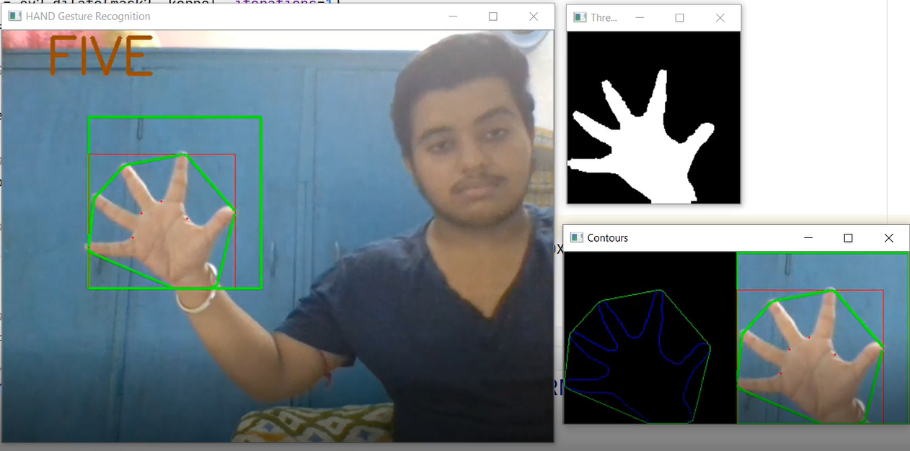
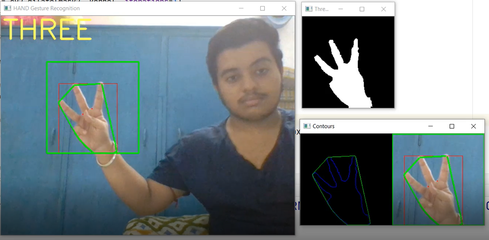
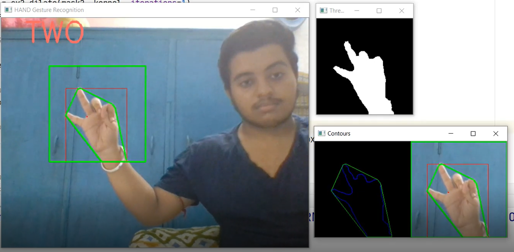
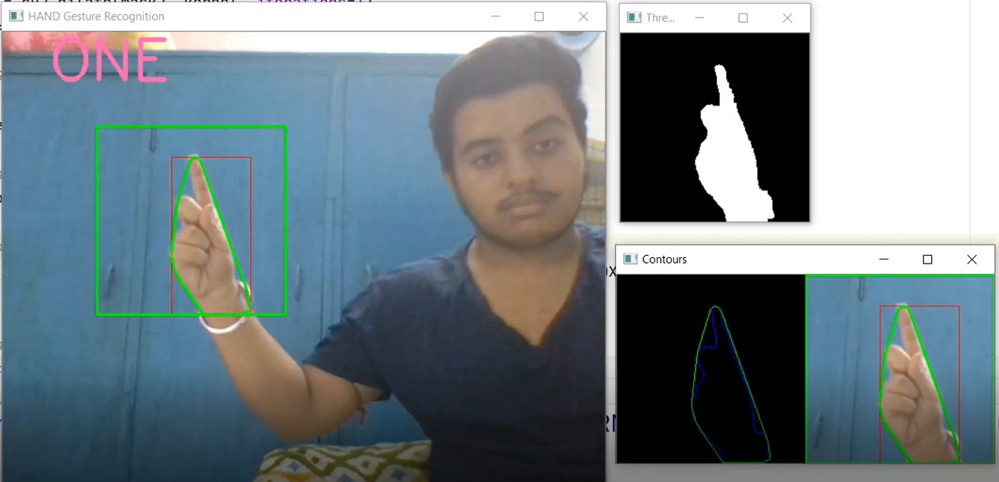
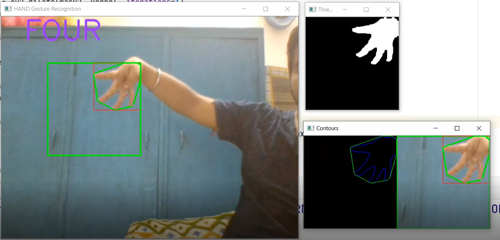
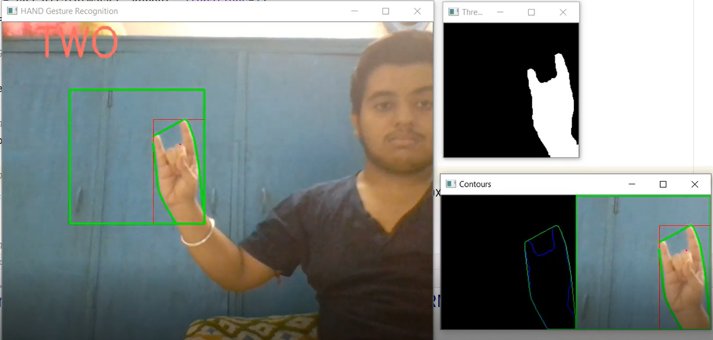
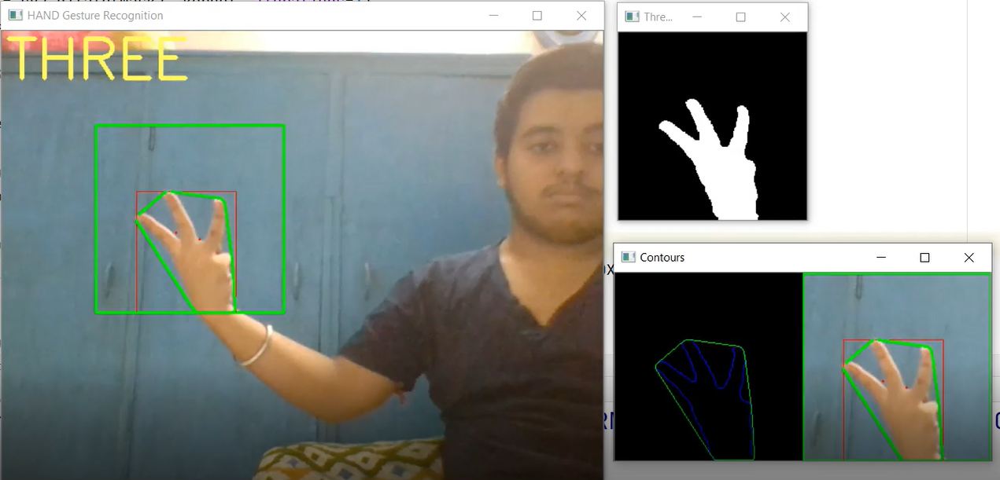
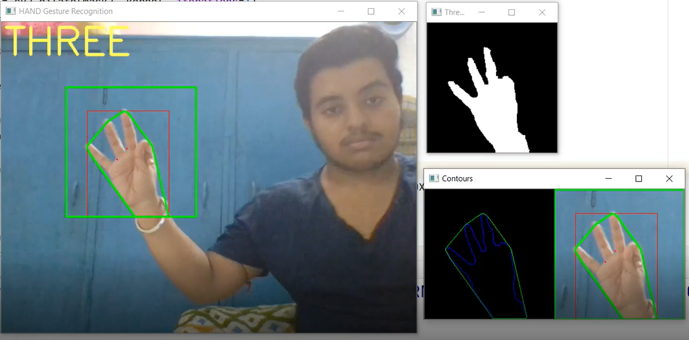

# HAND-GESTURE-RECOGNITION :star_struck:

[](https://shields.io/) [](https://shields.io/) [](https://shields.io/) [](https://shields.io/) [](https://shields.io/) [](https://shields.io/) [](https://shields.io/) [](https://shields.io/)
<br>
***This new Web application is created by Biswarup Bhattacharjee, student of BTECH, in University of Engineering and Management, Kolkata.***

**Email Id: bbiswa471@gmail.com.** 

**Contact No: 916290272740.** 

[](https://www.facebook.com/biswarup.bhattacharjee.5811) [](https://github.com/biswa2210)

## About :point_down: 


**:point_right: [click here to view or download Demo Video of this project](https://drive.google.com/file/d/1GZ9FvfGjo6xBK1YKJENIv0KINdOazDue/view)**

## Purpose :point_down:


## Use :point_down:

## Applications and Future Scopes:point_down:


## Folder Structure :point_down:
```bash
HAND-GESTURE-RECOGNITION
     ├── .idea
     |      ├── inspectionProfiles
     |      |          └── profiles_settings.xml
     |      ├── HAND GESTURE RECOGNITION.iml
     |      ├── misc.xml
     |      └── modules.xml
     ├── capture.png
     ├── hand gesture recognition.py
     └── part1.py

```                       
## Making :point_down:


## Screenshots :point_down: 
<div align="center">
<a href="hg1.PNG"></a> <a href="hg2.PNG"></a>

<a href="hg3.PNG"></a> <a href="hg4.PNG"></a>

<a href="hg5.PNG"></a> <a href="hg6.PNG"></a>

<a href="hg7.PNG"></a> <a href="hg8.PNG"></a>
</div>


